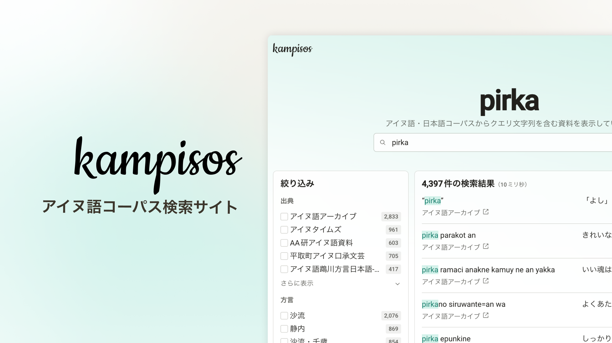

# Kampisos

Kampisos (カンピソㇱ) is a bilingual Ainu-Japanese corpus search application.
It helps users explore Ainu language materials through full-text search and rich facet filters.

## Features

- 🔍 Full-text search across corpus entries
- 🧭 Faceted filtering by dialect, source collection, author, and pronoun type
- 🗂️ Hierarchical dialect selector (multiple levels)
- 🎯 Highlighted search matches in entry text and translation
- ⚡ Fast paginated result browsing
- 📝 Changelog feed managed via microCMS
- 📱 Responsive UI for desktop and mobile

## Tech Stack

- **Framework:** Next.js (App Router) + React + TypeScript
- **UI:** Radix UI Themes and Radix Primitives
- **Search engine:** Algolia
- **Testing:** Vitest (unit) and Playwright (E2E)

## License

MIT
